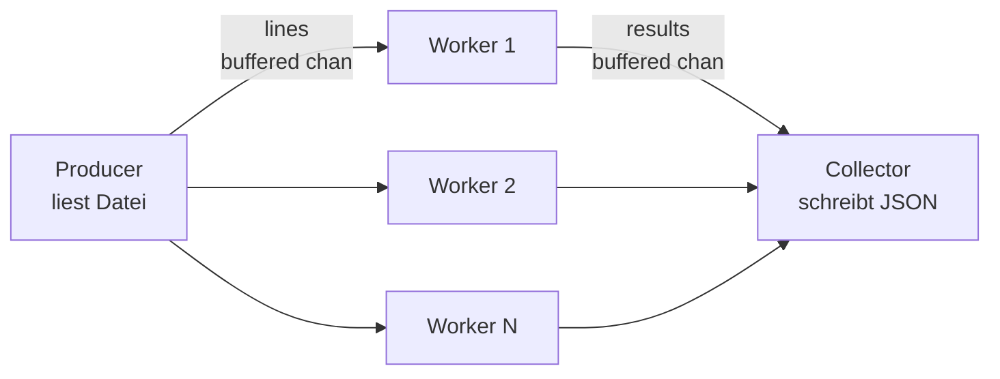

# Log-Analyse (Go)

Nebenläufiger Parser für Webserver-Logs in Go.

## Motivation

Dieses Projekt ist die Go-Variante des Python-Projekts [log-analyse-script](https://github.com/pseegel/log-analyse-script). Ziel ist die Vertiefung idiomatischer Go-Concurrency-Muster (Goroutines, Channels, Context) an einem konkreten Problem.

## Anforderungen

- Go >= 1.26
- Keine externen Abhängigkeiten zur Laufzeit

## Nutzung

Direkt mit `go run`:

```bash
go run . -input access.log -output report.json
```

Oder als Binary bauen und aufrufen:

```bash
go build
./log-analyse-go -input access.log -output report.json      # Linux / macOS
.\log-analyse-go.exe -input access.log -output report.json  # Windows
```

Hilfe anzeigen:

```bash
./log-analyse-go -h
```

Standardmäßig wird `access.log` im aktuellen Verzeichnis erwartet und nach `report.json` geschrieben. Input- und Output-Dateien können per Flag überschrieben werden.

## Beispiel-Input

[Beispiel](access.log)

## Architektur

Die Verarbeitung läuft als dreistufige Pipeline: ein Producer liest die Logdatei zeilenweise ein, mehrere Worker parsen die Zeilen parallel, und ein Collector aggregiert die Ergebnisse zum Report.



Der Producer öffnet die Datei und schickt jede Zeile in den `lines`-Channel. Sobald die Datei vollständig gelesen ist, wird der Channel geschlossen — das signalisiert den Workern das Ende der Eingabe.

Fünf Worker lesen parallel aus `lines`, parsen jede Zeile mit `parseLine` und schicken das Ergebnis in den `results`-Channel. Fehlerhafte Zeilen werden geloggt und übersprungen, ohne die Pipeline zu stoppen.

Der Collector liest aus `results`, zählt Status-Codes in einer Map und schreibt am Ende die Aggregation als JSON. Er weiß, dass alle Worker fertig sind, weil eine separate Goroutine `wg.Wait()` aufruft und danach `results` schließt.

Verwendete Concurrency-Primitive:

- Goroutines für Producer, Worker und den Schließ-Mechanismus von `results`
- Buffered Channels (Größe 100) für Backpressure ohne harte Blockade
- `sync.WaitGroup` zur Synchronisation der Worker
- `context.WithTimeout` als globale Abbruchbedingung (30 Sekunden)
- `select` mit `ctx.Done()` in Producer und Worker, damit die Pipeline auf Abbruch reagiert

## Entwicklung

Übliche Befehle während der Arbeit am Projekt:

```bash
go mod tidy
go fmt ./...
go vet ./...
go test ./...
go test -race ./...
```

Für Linting wird [golangci-lint](https://golangci-lint.run) empfohlen — das Pendant zu ruff im Schwester-Projekt:

```bash
golangci-lint run
```

Installation siehe Projektseite. Eine Konfiguration über `.golangci.yml` ist optional.

## Lizenz

MIT — siehe [LICENSE](LICENSE.md).
